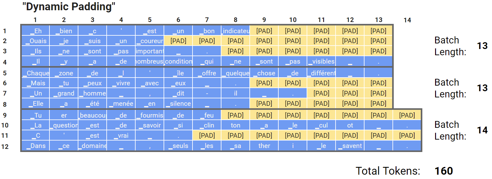
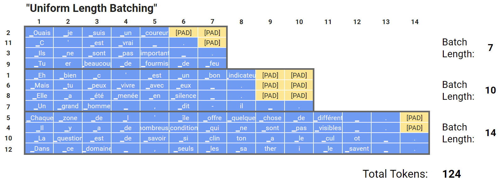

# Training a Transformer from Scratch for Language Translation

In this tutorial, we provide a step-by-step guide to train a transformer model from scratch using the TorcHood repository. The dataset in focus is sourced from [Hugging Face's Opus Books](https://huggingface.co/datasets/opus_books).

## Table of Contents

- [Training a Transformer from Scratch for Language Translation](#training-a-transformer-from-scratch-for-language-translation)
  - [Table of Contents](#table-of-contents)
    - [What is Dynamic Padding](#What-is-Dynamic-Padding)
    - [Step 0: Environment Setup](#step-0-environment-setup)
    - [Step 1: Essential Imports](#step-1-essential-imports)
    - [Step 2: Dataset and Model Initialization](#step-2-dataset-and-model-initialization)
    - [Step 3: Training the Model](#step-3-training-the-model)
  - [Observing Trained Model Results](#observing-trained-model-results)
  - [Final Thoughts](#final-thoughts)

______________________________________________________________________

### [Dynamic Padding](../torchood/data/components/opus_books.py)

In the real world of Natural Language Processing (NLP), dealing with text data of varying lengths is a common challenge. When we aim to process such data in batches, it's crucial that all sequences within a batch have the same length to create a uniform matrix representation. Achieving this uniformity involves a technique known as "dynamic padding."

<p align="center">
    
</p>

Dynamic padding involves modifying sequences to reach a common length within each batch, ensuring efficient processing in Transformer models. Rather than applying a fixed padding length across all sequences, dynamic padding adapts to the specific requirements of each batch.

Instead of rigidly appending a fixed number of pad tokens to each sequence, we limit the number of added pad tokens to match the length of the longest sequence within the batch. This flexibility minimizes the unnecessary use of pad tokens and is why we call it "dynamic" padding.

The pad token, typically representing no meaningful word, needs to be handled carefully during computations. Before calculating the loss, we nullify the pad token's impact by multiplying it by 0 through an "attention mask" matrix for each sample. This mask identifies and instructs the Transformer to disregard the \[PAD\] tokens during processing.

<p align="center">
    
</p>

To further enhance efficiency, we strive to create batches with sequences of similar lengths. This approach helps us avoid situations where most sequences in a mini-batch are short, requiring the addition of numerous pad tokens to each of them due to the presence of a single very long sequence.

By implementing dynamic padding and optimizing batch generation, we ensure that Transformer models can efficiently handle real-world NLP datasets with varying sequence lengths, leading to more effective and resource-efficient NLP applications.

<p align="center">
    
</p>

# [Parameter Sharing](../torchood/models/components/bilang_transformer.py)

[REFERENCE](https://arxiv.org/pdf/2104.06022.pdf)

<p align="center">
    
</p>

There are three major types for parameter sharing

1. Sequence : The simplest strategy is to assign the same parameters to sequential⌊N/M⌋ layers.We name this strategy SEQUENCE.For example,when we set M=3 and N=6,two sequential layers share their parameters as illustrated in Figure, Imagine group of 6 friends sharing 3 toys together, where 2 friends needs to share same toy

2. Cycle : In CYCLE ,we stack M layers whose parameters are independent from each other.Then,we repeat stacking the M layers with the identical order to the first M layers until the total number of layers reaches N.When we set M=3 and N=6,we stack 3 layers twice as illustrated in Figure.  For example you start with 3 friends and 3 different toys. You give them each a toy just like before. Then, you do it again with the same 3 toys for the next 3 friends. It's like going around in a circle twice. So, each friend has a different toy, and you follow this cycle of sharing.

3. CYCLE(REV) : In this strategy,we repeat stacking M layers in the same manner as CYCLE until M∗(⌈N/M⌉−1) layers.For the remaining layers, we stack M layers in the reverse order.When we set M=3 and N=6,we stack 3 layers and then stack the 3 layers in the reverse order as in Figure .Thus,the lowest layer and highest layer share parameters. For example you start with 3 friends again, and they each get a different toy, just like before. But this time, for the last 3 friends, you give them the same toys in the opposite order. So, the first friend gets the last toy, the second friend gets the second-to-last toy, and the third friend gets the first toy. It's like sharing toys in a special way!

### Step 0: Environment Setup

Ensure your system meets the following prerequisites:

1. **Repository Cloning**:

   ```bash
   git clone https://github.com/anantgupta129/TorcHood.git
   cd TorcHood
   ```

2. **Package Installation**:

   ```bash
   python setup.py sdist
   pip install .
   ```

______________________________________________________________________

### Step 1: Essential Imports

Load the required libraries and modules:

```python
import warnings
warnings.filterwarnings("ignore")

import os
import torch
import lightning.pytorch as pl

from torchood.models.bilang_module import BiLangLitModule
from torchood.data.opus_datamodule import OpusBooksDataModule
```

______________________________________________________________________

### Step 2: Dataset and Model Initialization

Set up your dataset and configure your model:

📄 Refer to the [sample configuration file for bilang](../torchood/configs/bilang_config.py) for hyperparameters and settings, and adjust as necessary.

```python
from torchood.configs.bilang_config import get_config

config = get_config()
config["batch_size"] = 32  # Update based on your GPU capacity

datamodule = OpusBooksDataModule(config, pin_memory=True)
datamodule.prepare_data()
datamodule.setup()
```

______________________________________________________________________

### Step 3: Training the Model

Start training your model using PyTorch Lightning:

1. **Standard Training Setup**:

```python
from lightning.pytorch.callbacks import (
    LearningRateMonitor,
    RichProgressBar,
)
from lightning.pytorch.loggers import WandbLogger

model = BiLangLitModule(learning_rate=config["lr"],
                        config=config,
                        tokenizer_src=datamodule.tokenizer_src,
                        tokenizer_tgt=datamodule.tokenizer_tgt)

callbacks = [
    RichProgressBar(leave=True),
    LearningRateMonitor(logging_interval="step"),
]

# Optional: Logging with Weights & Biases
logger = WandbLogger(project="Transformers-BiLang")

trainer = pl.Trainer(callbacks=callbacks, max_epochs=10, accelerator="gpu")
trainer.fit(model=model, datamodule=datamodule)
```

______________________________________________________________________

## Observing Trained Model Results

To delve into a detailed performance analysis and visualization of the trained model, visit [Weights & Biases](https://wandb.ai/anantgupta129/Transformers-BiLang/workspace?workspace=user-anantgupta129).

______________________________________________________________________

## Final Thoughts

As you've progressed through this tutorial, you've gained hands-on experience in training a transformer model from scratch using the TorcHood repository. Experiment further by tweaking the configurations and dataset for enhanced results.

Happy Modeling !!
